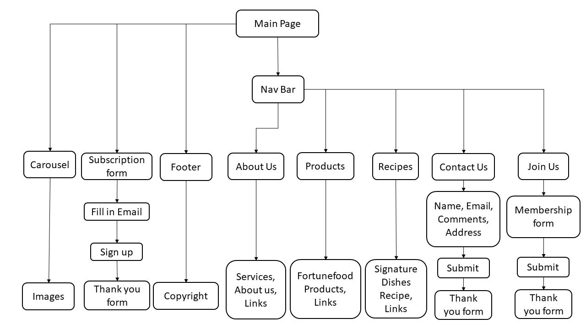

# Content
1. Summary of project
2. UX/UI 
3. Features 
4. User Stories
5. Technologies Used
6. Testing 
7. Deployment
8. Live Link
9. Credits and Acknowledgement

# Title : Mini Project - FortuneFood

## 1. Summary
* Fortunefood webpage is not fully mobile responsive
* It sparks my interest to recreate it's website to serve the community better 

## 2. UI/UX

### 2.1 Scope
The purpose of this mini project is to recreate a new layout of fortunefood.sg. Bring convenience of access to public about the company products through webpage

### 2.2 Strategy 
* Create a webpage to inform public and audience about fortune food product
* Provide location of their manufacturing location, enabling publics or companies to purchase food from them.

#### 2.2.a. User Goals
* Targeted Audience: Public,Companies
* Users are able to find their desired products in the webpage

#### 2.2.b. Organisation's Goals
* Able to provide company's product information and knowledge to the public

### 2.3 Structure
 * Nav bar: white background 
  Nav bar: fortune food logo 
  Nav bar: contains tab -  about us, products, recipes, contact us (able to link to respective page when click) 
  Nav bar:   about us, products, recipes, contact us(color will change to black when mouse hover over tab) 
   Nav bar: Join Us(Upon clicking it will bring users to the membership page) 

* Carousel: 5 images - tofu, udon, noodles,all products of fortunefood, factory manufacturing picture 

* Subscription form: a subscription form embedded within carousell in large screen 
  Subscription form: will be below carousell when in smaller mobile version 

* About us: Show the services available in singapore and about the company's manufacturing mission and goals 

* Products: chinese tofu, silken taukwa, hongkong noodles, hokkkien mee, taukwa, fortune udon, grass jelly, extra smooth tofu, egg tofu  
* Recipes:  Tofu red rice, Braised tofu mushroom, Eight treasure rice, Tofu fish roe, Agedashi tofu, Seafood porridge 

* Contact us form: email, names, comments, submit button  
  

* Address: address details with map 

### 2.4 Skeleton
Webpage consists of simple 3 components
* Navbar
* Body
* Footer

Navbar is located at the top of webpage. 
Navbar consists of logo and name hyperlinks to respective pages. 
Footer at the bottom page with copyright and font aswesome logo. 

### 2.5 Surface 

#### 2.5.a Background 
* Background Colors: grey,red and white to promote the company's brand name 
* Button Colors :  Red  

#### 2.5.b Typography 

* Font Color :grey/ black/ red/ white to blend with the background color
* Font Family: Normal(Default)
* Font Size : 0.6 - 2 rem, h1,h2,h6 to match with background settings

#### 2.5.c Images 
* Images : udon,noodles,tofu images for carousel, food icon and logo to fit the theme
* Website is able to view in mobile size (XS) and for large display like desktop

## 3. Features 

### Navigation Bar 
  *  About us, Products, Recipes, Contact us, Join Us(click tab to link to respective page)
### Subscription Form  
  * Users may key in their email to the email box to get food updates. 

### About Us 
  *  Under the description there is a red click here to link to fortunefood website for more information
### Products 
  * Under the product description there is a red click here to link to fortunefood website for more information
  * Click on the product names for product description
### Recipes  
* Click on each dishes picture or name to link to the recipe 
### Contact us 
  * User able to  type in email, comments, names 

  

## 4. User Stories
As a user i would like to know the various products and venue of where to buy fortunefood products 

### 4.1 Acceptance criteria
Function of the  webpage allows user's to search for a variety of food and company location.

## 5. Technologies Used
* HTML
* CSS
* [Bootstrap](https://getbootstrap.com/docs/5.0/getting-started/introduction/) aligning content, match its mobile responsiveness,carousel
* [Flaticon](https://www.flaticon.com/)  icons and legend
* [Canva](https://www.canva.com) basically red white grey colour theme for webpage
* [Googlemap](https://www.google.com/maps) for company location

## 6. Testing  

|Categories      |Sections                       |Test Output                                                                                                   |
| :-------       | :------------                 | :-------------------                                                                                         |
|Webpage         |Mobile Responsiveness          |No visible error                                                                    |
|Navigation Bar  |About us Tab                   |Link to About us section, when hover over tab color  will change                    |
|Navigation Bar  |Products Tab                   |Link to Products section, when hover over tab color will change                     |
|Navigation Bar  |Recipes Tab                    |Link to Recipe section, when hover over tab color will change                       |
|Navigation Bar  |Contact Us Tab                 |Link to Contact Us section, when hover over tab color will change                   |
|Navigation Bar  |Join Us Tab                 |Link to Membership signup section, when hover over tab color will change                   |
|Navigation Bar  |Mobile Responsiveness          |Adjust accordingly to screen size,links in navbar will be hidden in nav dropdown button|
|Carousel        |Images                         |Able to auto slide, change to next image                                             |
|Carousel        |Mobile Responsiveness          |Autoslide function still works in different screen size                      |
|Content         |Subscription form              |Able to enable user input                                                           |
|Content         |About Us                       |Able to link to the destinated webpage for information       |
|Content         |Products                       |Able to link to the destinated webpage for information       |
|Content         |Products                       |Product names able to show description upon clicking    |
|Content         |Recipes                        |Able to link to the destinated webpage for information       |
|Content         |Contact us                     |Forms are able to let user input info          |
|Content         |Address                       |Able to show address under google map                                                 |
|Content         |Mobile Responsiveness          |Able to view in different screen size                                              |
|Footer          |Mobile Responsiveness          |Able to view in different screen size                                         |

## 7. Deployment 

 Host by using Replit.

**Steps for deployment:**
* Run index.html

## 8. Live link
https://fortunefood.xun89.repl.co

## 9. Credits and Acknowledgement
Credits to:

Fortunefood (using their web link, pictures and information) 
Googlemap (using googlemap for company address location) 
Bootstrap  
color-hex.com (colour codes used)

All instructors, teaching staffs and  management of trent global college for their dedication and assistance towards this mini project

